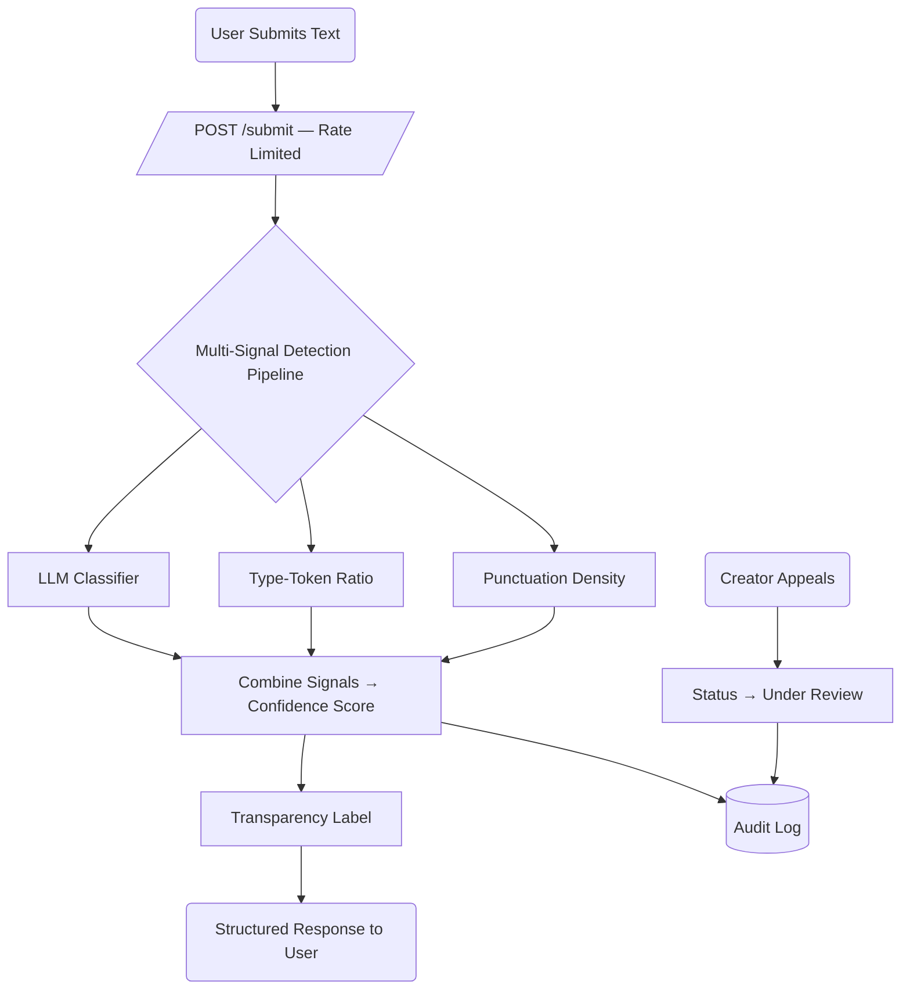

# Provenance Guard

A content-attribution API that estimates whether a piece of text was written by a human or generated by AI, and — crucially — communicates that estimate **with its uncertainty made explicit**. It combines three detection signals into a single calibrated confidence score, renders a plain-language transparency label for non-technical readers, records every decision in a structured audit log, and lets creators appeal a classification.

> **Repository:** _<add your GitHub repo link here>_

---

## Architecture Overview — the path a submission takes

A submission flows from raw text to a transparency label like this:

```
POST /submit (rate-limited)
      │
      ▼
detector.analyze(text)
      │
      ├─ signal_llm(text)          → {confidence, reason}   # Groq LLM verdict
      ├─ signal_ttr(text)          → {confidence, ttr}      # vocabulary diversity
      └─ signal_punctuation(text)  → {confidence, density}  # punctuation regularity
      │
      ▼
scoring.combine(llm, ttr, punct)   → weighted confidence in [0, 1]
      │
      ▼
short-input rule (< 50 tokens → forced "uncertain")
      │
      ▼
scoring.bucket(confidence)         → likely_ai | uncertain | likely_human
      │
      ▼
labels.make_label(confidence, attribution)  → reader-facing text
      │
      ├─────────────► audit_log.log_decision(...)   # structured SQLite row
      ▼
JSON response { content_id, attribution, confidence, label, signals, short_input }
```



### Module map

| File           | Responsibility                                                              |
| -------------- | --------------------------------------------------------------------------- |
| `app.py`       | Flask routes: `POST /submit`, `POST /appeal`, `GET /log`, `GET /appeals`; rate limiter; 429 handler |
| `signals.py`   | The three detection signals + shared tokenizer                              |
| `scoring.py`   | `combine()` blend, `bucket()` thresholds, weights & `MIN_TOKENS`            |
| `labels.py`    | `make_label()` — the three transparency-label variants                      |
| `detector.py`  | `analyze()` — orchestrates signals → score → label, applies short-input rule |
| `audit_log.py` | SQLite audit log: decisions + appeals                                       |
| `demo_test.py` | M4 verification harness (runs four inputs, prints per-signal breakdown)      |

Design rationale and per-feature specs live in [`planning.md`](planning.md) and [`specs/`](specs/).

### Running it

```bash
pip install -r requirements.txt
echo "GROQ_API_KEY=your_key_here" > .env
python app.py            # serves on http://localhost:5001
```

> **macOS note:** the app runs on port **5001**, not 5000 — AirPlay Receiver occupies 5000 and returns empty `403`s. See [`essentials/issues.md`](essentials/issues.md).

---

## Detection Signals

The pipeline runs **three** signals. Each outputs a normalized `confidence` in `[0, 1]` (0 = strongly human, 1 = strongly AI). Only the LLM signal reads meaning; the two statistical signals corroborate and act as tie-breakers.

### 1. LLM classifier (Groq) — primary signal

- **Measures:** whether the prose *reads* as machine-generated — fluency, generic phrasing, absence of personal idiosyncrasy.
- **Why chosen:** it's the only signal that understands content. Statistical heuristics can be gamed or coincidentally triggered; an LLM judges the text the way a human skeptic would.
- **What it misses:** it's a soft, sometimes-overconfident judge; it can be fooled by deliberately "humanized" AI text, and it costs a paid API call per request. Output is clamped to `[0.05, 0.95]` so a hallucinated `0.0`/`1.0` can't single-handedly dominate the blend, and any API/parse failure degrades gracefully to `0.5` (fully uncertain).

### 2. Type-token ratio (TTR)

- **Measures:** vocabulary diversity = `unique_words / total_words` over a fixed 200-token window. AI drafts often reuse a narrower, "safe" vocabulary.
- **Why chosen:** cheap, deterministic, and a real stylometric signal at length.
- **What it misses:** on short submissions almost every word is unique (TTR ≈ 0.82 for all four of our test inputs), so at these lengths it barely discriminates and mostly contributes a mild human-leaning bias. It only earns its keep on longer texts. This is a documented limitation, not a bug — it's why it carries only 20% weight.

### 3. Punctuation density

- **Measures:** `punctuation_marks / word_count`. AI text trends toward uniform, textbook punctuation; human creative/casual text is more erratic (very sparse or very heavy).
- **Why chosen:** captures a stylistic fingerprint the LLM and TTR both ignore.
- **What it misses:** it's a weak proxy — "clean" punctuation is common in careful human writing too, so it produces false positives on formal prose.

**Combine rule** (`scoring.py`), LLM-dominant:

```
confidence = 0.60 · llm + 0.20 · ttr + 0.20 · punct
```

The LLM carries the majority weight because it's the only semantically-aware signal; the two statistical signals split the remaining 40% and mostly matter when the LLM is near 0.5.

---

## Confidence Scoring

### How signals are combined

Each signal is normalized to a common `[0, 1]` AI-likelihood axis with documented calibration (see [`specs/detection_signals.md`](specs/detection_signals.md)), then blended with the weighted average above. The combined score maps to a bucket:

| Combined `confidence` | Bucket          |
| --------------------- | --------------- |
| `>= 0.70`             | **likely_ai**   |
| `0.40 – 0.69`         | **uncertain**   |
| `< 0.40`              | **likely_human**|

The score is an **aggregate heuristic, not a calibrated statistical probability** — `0.6` means "signals lean AI, treat as a weak indication," not "60% mathematically proven." Inputs under 50 tokens are routed to `uncertain` regardless of score, since no signal is reliable on tiny inputs.

### How we validated it's meaningful

We ran four deliberately-chosen inputs (obvious-AI, obvious-human, and two borderline cases) through `demo_test.py` and confirmed: obvious cases land in the outer buckets near the extremes, ambiguous cases land in the middle, and different inputs produce **noticeably different scores** (range 0.220 → 0.703) — the label is not a constant. We also confirmed by driving the LLM signal to 0.9 / 0.5 / 0.1 that the blend yields 0.74 / 0.50 / 0.26, so a `0.51` and a `0.95` produce genuinely different labels.

### Two example submissions with different confidence scores

**High-confidence (AI-generated):**

> "Artificial intelligence represents a transformative paradigm shift in modern society. It is important to note that while the benefits of AI are numerous, it is equally essential to consider the ethical implications. Furthermore, stakeholders across various sectors must collaborate to ensure responsible deployment…"

| Signal | Score |
| --- | --- |
| LLM | 0.900 |
| TTR | 0.200 |
| Punctuation | 0.617 |
| **Combined** | **0.703 → likely_ai** |

**Lower-confidence (human-written):**

> "ok so i finally tried that new ramen place downtown and honestly? underwhelming. the broth was fine but they put WAY too much sodium in it and i was thirsty for like three hours after… probably won't go back unless someone drags me there."

| Signal | Score |
| --- | --- |
| LLM | 0.200 |
| TTR | 0.200 |
| Punctuation | 0.480 |
| **Combined** | **0.256 → likely_human** |

A ~0.45 gap between the two — clear, meaningful separation.

---

## Transparency Label

The label displayed to readers changes with the confidence score. The three variants (verbatim, with `{confidence}` rendered as a percentage):

**High-confidence AI** (`confidence >= 0.70`):

> Likely AI-generated. Our automated checks strongly suggest this text was produced with AI assistance (confidence: 70%). This is an automated estimate, not a certainty — the creator can appeal.

**High-confidence human** (`confidence < 0.40`) — reports `1 − confidence` ("confidence this is human"):

> Likely human-written. Our automated checks found little sign of AI generation (confidence this is human: 74%). This is an automated estimate, not a guarantee.

**Uncertain** (`0.40 <= confidence < 0.70`, or any sub-50-token input):

> Uncertain origin. Our checks were inconclusive for this text (AI-likelihood: 65%). We can't confidently attribute it to a human or AI. Treat this result as a weak signal only.

(Percentages above are from actual test runs — 70%, 74%, and 65% respectively.)

---

## Rate Limiting

Applied with Flask-Limiter (in-memory storage), keyed on client IP.

| Endpoint            | Limit                     | Reasoning                                                                                          |
| ------------------- | ------------------------- | ------------------------------------------------------------------------------------------------- |
| `POST /submit`      | **10 / minute; 100 / day**| Every submission makes a paid, latency-heavy Groq call. 10/min is generous for a human submitting their own work but stops a script from flooding the system; the 100/day ceiling caps total API cost even against a slow drip of requests. |
| `POST /appeal`      | **5 / minute**            | Appeals are rare, deliberate human actions; a low cap is more than enough and blocks abuse.       |
| `GET /log`, `GET /appeals` | none               | Read-only, no LLM call, cheap — no need to limit for this project.                                 |

Exceeding a limit returns **HTTP 429** with a JSON body (`{"error": "Rate limit exceeded.", "detail": "..."}`). Because storage is in-memory, restarting the app resets all counters (handy for testing the daily cap).

**Verification** (12 rapid requests → first 10 succeed, rest are throttled):

```bash
for i in $(seq 1 12); do
  curl -s -o /dev/null -w "%{http_code}\n" -X POST http://localhost:5001/submit \
    -H "Content-Type: application/json" \
    -d '{"text": "rate limit test with enough words to clear validation here", "creator_id": "ratelimit-test"}'
done
# → 200 ×10, then 429 ×2
```

---

## Audit Log

Every submission writes a structured SQLite row capturing the timestamp, `content_id`, text excerpt, attribution, combined confidence, **each individual signal score** (`llm_score`, `ttr_score`, `punct_score`), the label shown, and status. An appeal updates that same row in place — flipping `status` to `under_review` and attaching the creator's reasoning. `GET /log` returns recent entries; `GET /appeals` returns the reviewer queue.

Example entry after a submission and an appeal:

```json
{
  "content_id": "b6dd6beb-2525-4668-b9b4-f7a8aa6003c1",
  "creator_id": "test-user-1",
  "timestamp": "2026-07-04T00:13:42.508766+00:00",
  "text_excerpt": "Artificial intelligence represents a transformative paradigm shift...",
  "attribution": "likely_ai",
  "confidence": 0.703,
  "llm_score": 0.9,
  "ttr_score": 0.2,
  "punct_score": 0.617,
  "label": "Likely AI-generated. Our automated checks strongly suggest...",
  "status": "under_review",
  "appeal_id": "2d9c3601-c515-4993-a1e7-1b094f54b4f5",
  "appeal_reasoning": "I wrote this myself; I am a non-native speaker so my style reads formal.",
  "appeal_timestamp": "2026-07-04T00:13:42.614238+00:00"
}
```

---

## Appeals Workflow

- **Who:** the content creator, referencing the `content_id` from their `/submit` response.
- **What they provide:** `content_id` + `creator_reasoning` (free text).
- **What happens:** `POST /appeal` looks up the original decision, flips its status `classified → under_review`, records the reasoning and an `appeal_id` on the audit row, and returns a confirmation. No automated re-classification — a human reviewer sees the queue via `GET /appeals`.

```bash
curl -s -X POST http://localhost:5001/appeal \
  -H "Content-Type: application/json" \
  -d '{"content_id": "PASTE-CONTENT-ID", "creator_reasoning": "I wrote this myself from personal experience."}' \
  | python -m json.tool
```

---

## Known Limitations

**Lightly-edited ("humanized") AI text is misclassified as human.** In our test set, an AI-generated paragraph with a few manual edits and a conversational hedge ("Honestly, I don't think there's a one-size-fits-all answer…") scored **0.220 → likely_human** — a false negative. This happens *by design of the signals*: the LLM signal keys on personal tone and nuance, so an added first-person reflection flips its verdict from 0.9 to 0.2; meanwhile the punctuation and TTR signals also read the varied, casual style as human. This is the adversarial worst case for any detector, and we document it rather than claim to defeat it.

**Secondary limitation — formal human writing skews toward AI.** Dense, technical human prose (our monetary-policy paragraph) scored **0.650 → uncertain**: the LLM read its formal register as machine-like (0.8) and punctuation density landed squarely in the "suspiciously clean" band (0.65). A human expert's careful writing gets flagged as possibly-AI. The `uncertain` bucket and the appeals workflow exist precisely to catch these cases without over-committing.

---

## Spec Reflection

**How the spec helped:** writing [`specs/confidence_scoring.md`](specs/confidence_scoring.md) *before* coding pinned the weights (`0.60/0.20/0.20`) and bucket thresholds (`0.70`/`0.40`) as a single source of truth. When the AI coding assistant first generated scoring logic, it silently used different cutoffs — having the spec in hand made that divergence obvious immediately, so it was corrected instead of shipped.

**How the implementation diverged:** `planning.md` described appeals as "writing an audit-log entry linking the appeal to the original decision," which implied a *second* row. In implementation I instead **update the original row in place** (flip `status`, attach the appeal fields). This is simpler, keeps one authoritative record per `content_id`, and directly satisfies both the reviewer-queue query (`WHERE status = 'under_review'`) and the milestone test ("the log entry shows `status: under_review` and `appeal_reasoning` populated"). The spec was updated to match.

---

## AI Usage

**1. Scaffolding the app and detection signals.** I directed the AI assistant to generate a Flask skeleton and the signal functions from `planning.md` and the `specs/`. It produced working modules, but I revised substantially before accepting: I **restructured a single `app.py` into focused modules** (`signals.py`, `scoring.py`, `labels.py`, `detector.py`), **fixed a bug where `/appeal` was implemented as a `GET` that just dumped the log** (it needed to be a `POST` that flips status and records reasoning), and **corrected the audit-log schema**, which was missing the individual signal scores and appeal fields required by Milestones 4 and 5.

**2. Calibrating and validating the scoring.** I directed the AI to build the confidence-scoring blend and then ran `demo_test.py` to inspect real output. The first model (`llama-3.1-8b-instant`) was too soft a discriminator — clearly-AI text only reached 0.58 (`uncertain`). Rather than blindly trust the numbers, I **inspected the per-signal breakdown**, saw the LLM capping at 0.70 and TTR contributing a constant human-ward drag, and **overrode the model choice** (switched to `llama-3.3-70b-versatile`), which moved the same input to 0.703 (`likely_ai`). I deliberately **did not over-tune the TTR signal** to force better numbers — its weakness at short lengths is real and is documented in Known Limitations instead.

---

## Portfolio Walkthrough

_<add link to your short walkthrough video here>_ — a couple of minutes showing a submission end-to-end (submit → label → log → appeal) and a walk through the multi-signal scoring and the honest limitations.