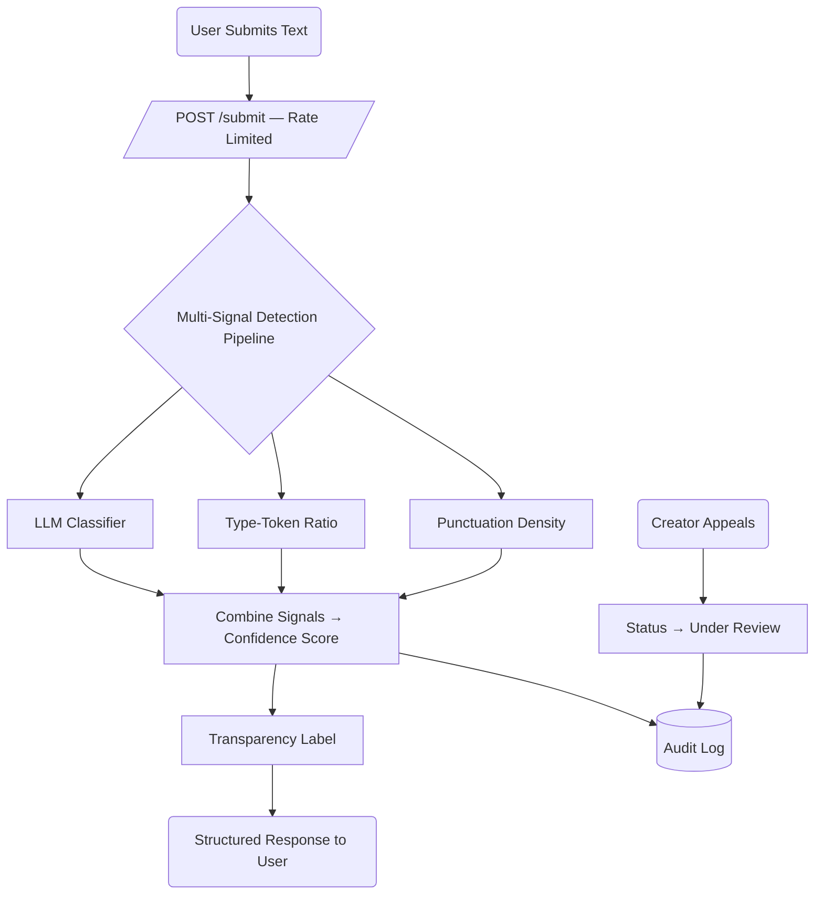

## Features

### Required

1. **Content Submission Endpoint** — API endpoint that accepts text-based content (poem, story excerpt, blog post) for attribution analysis. Returns a structured response including the attribution result, confidence score, and the transparency label text shown to the user.
2. **Multi-Signal Detection Pipeline** — Classify content using at least 2 distinct signals (single-signal is not acceptable). Each signal's purpose and rationale documented in `planning.md` and `README`.
3. **Confidence Scoring with Uncertainty** — Return a confidence score, not just a binary label. The score reflects genuine uncertainty (0.51 produces a meaningfully different label than 0.95). Document the approach and how score meaningfulness was tested.
4. **Transparency Label** — A plain-language label displayed to readers that makes the confidence level meaningful to a non-technical audience. Three variants (high-confidence AI, high-confidence human, uncertain) written out verbatim in the `README`.
5. **Appeals Workflow** — Mechanism for creators to contest a classification. At minimum: capture the creator's reasoning, log the appeal alongside the original decision, and update the content's status to "under review." (Automated re-classification not required.)
6. **Rate Limiting** — Rate limiting on the submission endpoint, with chosen limits and reasoning documented in the `README`.
7. **Audit Log** — Structured audit log capturing every attribution decision, including confidence score, signals used, and any appeals. At least 3 entries visible (in `README` or via `GET /log`).

## Detection Signals

The pipeline runs three signals. Each produces a normalized `confidence` in `[0, 1]` (0 = strongly human, 1 = strongly AI). Only the LLM signal actually "reads" the text; the two statistical signals corroborate and act as tie-breakers.

| Signal | What it measures | Raw output | Normalized to `confidence` |
| --- | --- | --- | --- |
| **LLM classifier** (Groq) | Whether the prose *reads* as machine-generated — fluency, generic phrasing, lack of idiosyncrasy | Model returns a JSON `{ "confidence": 0.0–1.0, "reason": "…" }` | Used directly (clamped to `[0,1]`) |
| **Type-token ratio (TTR)** | Vocabulary diversity = `unique_words / total_words`. AI drafts often reuse a narrower, "safe" vocabulary | Ratio `0.0–1.0` (length-sensitive, so computed on a fixed 200-token window) | Mapped so **low diversity → high `confidence`** (see calibration) |
| **Punctuation density** | Regularity/cleanliness of punctuation = `punct_marks / total_tokens`. AI text tends toward uniform, textbook punctuation; human creative text is more erratic | Ratio, typically `0.0–0.3` | Mapped so **very "clean/average" density → higher `confidence`**, extremes (very sparse or very heavy) → lower |

### Combining into one confidence score

Weighted average, LLM-dominant:

```
confidence = 0.60 * llm + 0.20 * ttr + 0.20 * punct
```

Rationale: the LLM is the only semantically-aware signal, so it carries the majority weight. The two statistical signals split the remaining 40% and mostly matter when the LLM is unsure (~0.5) — they can nudge a borderline case, but cannot override a confident LLM verdict on their own. Weights are documented so they can be tuned against the test set.

## Uncertainty Representation

**What `confidence = 0.6` means:** "Our signals lean toward AI, but not decisively — treat this as a weak indication, not a verdict." The score is an *aggregate heuristic confidence*, not a calibrated statistical probability. We say this explicitly so no one over-reads it.

**Calibration (raw → normalized).** Each statistical signal is mapped through a documented range rather than used raw:
- **TTR:** empirically, human creative text on a 200-token window lands ~0.55–0.75; heavy AI reuse drifts lower. We map `ttr >= 0.70 → confidence ≈ 0.2`, `ttr <= 0.45 → confidence ≈ 0.8`, linear in between.
- **Punctuation density:** we map distance from a "suspiciously average" band. Density inside ~0.06–0.10 (clean, even) → `confidence ≈ 0.65`; far outside that band → `confidence ≈ 0.3`.
- **LLM:** passed through, clamped, with a hard floor/ceiling so a hallucinated `0.0`/`1.0` still leaves room for the other signals to move the blend.

**Thresholds:**

| Combined `confidence` | Bucket |
| --- | --- |
| `>= 0.70` | **Likely AI** |
| `0.40 – 0.69` | **Uncertain** |
| `< 0.40` | **Likely human** |

**How we'll test that the score is meaningful (not decorative):** feed a small labeled set — obvious-AI text, obvious-human text, and deliberately ambiguous text — and confirm (a) obvious cases land in the outer buckets with `confidence` near the extremes, (b) ambiguous cases land in the uncertain band, and (c) `0.51` and `0.95` produce *different labels*, not the same one. Record these runs as the ≥3 required audit-log entries.

## Transparency Label Design

Three verbatim variants. Each states the finding, the confidence in plain terms, and that it's an estimate.

- **High-confidence AI (`confidence >= 0.70`):**
  > **Likely AI-generated.** Our automated checks strongly suggest this text was produced with AI assistance (confidence: {confidence:.0%}). This is an automated estimate, not a certainty — the creator can appeal.

- **High-confidence human (`confidence < 0.40`):**
  > **Likely human-written.** Our automated checks found little sign of AI generation (confidence this is human: {1-confidence:.0%}). This is an automated estimate, not a guarantee.

- **Uncertain (`0.40 <= confidence < 0.70`):**
  > **Uncertain origin.** Our checks were inconclusive for this text (AI-likelihood: {confidence:.0%}). We can't confidently attribute it to a human or AI. Treat this result as a weak signal only.

## Appeals Workflow

- **Who can appeal:** the content creator (the submitter). Appeal is tied to a prior `submission_id` returned by `/submit`.
- **What they provide:** `submission_id` + free-text `reason` (their explanation / evidence of authorship). Optional contact field.
- **What the system does on receipt** (`POST /appeal`):
  1. Look up the original decision by `submission_id`.
  2. Set that submission's status `classified → under_review`.
  3. Write an audit-log entry linking the appeal to the original decision (original `confidence`, signals, timestamp, appeal reason).
  4. Return a confirmation with an `appeal_id` and the new status. (No automated re-classification.)
- **What a human reviewer sees in the queue** (`GET /appeals` or the review view): a list of `under_review` items, each showing the original text (or excerpt), the original `confidence` and bucket, the three per-signal scores, the transparency label that was shown, the creator's stated reason, and timestamps for submission and appeal.

## Anticipated Edge Cases

Specific scenarios where the heuristics will mislead:

1. **Formal/technical human writing (résumé bullets, legal boilerplate, API docs).** Deliberately clean, uniform punctuation and a constrained, repetitive professional vocabulary — exactly the pattern our TTR and punctuation-density signals read as "AI." A human-written cover letter could score falsely high. Mitigation: LLM weight dominates, and the uncertain band + appeals catch the rest.
2. **Short, highly-stylized poetry (repetition-heavy verse, minimalist free verse).** A poem built on refrain and simple diction ("so much depends / upon…") drives TTR *down* and can push `confidence` up, while its brevity makes the 200-token window unreliable. Genuinely human art gets flagged as machine reuse.
3. **AI text lightly edited by a human ("humanized" output).** A few manual word swaps and added typos can restore vocabulary diversity and punctuation irregularity enough to slip under the thresholds — a false *negative*. This is the adversarial worst case; we document it as a known limitation rather than claim to defeat it.
4. **Very short submissions (< ~50 tokens).** All three signals are statistically unstable on tiny inputs. Plan: enforce a minimum length or automatically route sub-threshold inputs to the **Uncertain** bucket regardless of raw scores.

## AI Tool Plan

How I'll use an AI coding tool across the three implementation milestones — what spec context to feed it, what to ask for, and how to verify before moving on.

### M3 — Submission endpoint + first signal

- **Spec sections to provide:** *Detection Signals* (specifically the LLM classifier row + the combine subsection) and the *Architecture* diagram.
- **Ask it to generate:** a minimal Flask app skeleton (`/submit` route accepting JSON text, returning a structured response) plus the first signal function — the LLM classifier that calls Groq and returns `{ "confidence": 0.0–1.0, "reason": "…" }`.
- **How to verify:** call the signal function directly (outside the endpoint) on a few hand-picked inputs — one obviously-AI paragraph, one obviously-human paragraph — and confirm it returns a parseable score in range and in the expected direction *before* wiring it into `/submit`. Then hit `/submit` once end-to-end.

### M4 — Second signal + confidence scoring

- **Spec sections to provide:** *Detection Signals* (TTR + punctuation-density rows), *Uncertainty Representation* (calibration ranges, thresholds), and the *Architecture* diagram.
- **Ask it to generate:** the second statistical signal function(s) (TTR, and punctuation density if included) with the documented raw→`confidence` calibration, plus the scoring logic that blends all signals (`0.60·llm + 0.20·ttr + 0.20·punct`) into one combined `confidence` and maps it to a bucket.
- **What to check:** feed clearly-AI vs. clearly-human vs. deliberately-ambiguous text and confirm scores *vary meaningfully* — obvious cases land near the extremes and in the outer buckets, ambiguous text lands in the Uncertain band, and `0.51` vs `0.95` produce different labels. Capture these runs as audit-log entries.

### M5 — Production layer

- **Spec sections to provide:** *Transparency Label Design* (the three verbatim variants), *Appeals Workflow*, and the *Architecture* diagram.
- **Ask it to generate:** the label-generation logic (map combined `confidence` → the correct one of three label strings, with the `{confidence:.0%}` values filled in) and the `POST /appeal` endpoint (look up `submission_id`, flip status `classified → under_review`, write the linked audit entry, return `appeal_id`), plus the reviewer view (`GET /appeals`).
- **How to verify:** confirm all three label variants are reachable by submitting inputs that fall in each bucket; then submit → appeal a decision and confirm the status changes to `under_review`, the appeal is logged against the original decision, and it shows up in the appeals queue.

## Module Map

The implementation is split into focused modules (each detailed in the matching `specs/*.md`):

| File            | Responsibility                                                        | Spec |
| --------------- | --------------------------------------------------------------------- | ---- |
| `app.py`        | Flask routes only: `POST /submit`, `POST /appeal`, `GET /log`, `GET /appeals`, `/`, rate limiter, 429 handler | `rate_limit.md` |
| `signals.py`    | The three detection signals (`signal_llm`, `signal_ttr`, `signal_punctuation`) + shared tokenizer | `detection_signals.md` |
| `scoring.py`    | `combine()` blend, `bucket()` thresholds, weights & constants (`MIN_TOKENS`) | `confidence_scoring.md` |
| `labels.py`     | `make_label()` — the three transparency-label variants                | `transparency_label.md` |
| `detector.py`   | `analyze(text)` — orchestrates signals → score → label, applies short-input rule | `confidence_scoring.md` |
| `audit_log.py`  | SQLite audit log: `log_decision`, `record_appeal`, `read_log`, `get_appeals`, `get_entry`, `init_db` | `audit_log.md` |

Data flow: `app.submit` → `detector.analyze` → (`signals.*` → `scoring.combine`/`bucket` → `labels.make_label`) → `audit_log.log_decision`. Appeals: `app.appeal` → `audit_log.record_appeal`.

## Architecture


